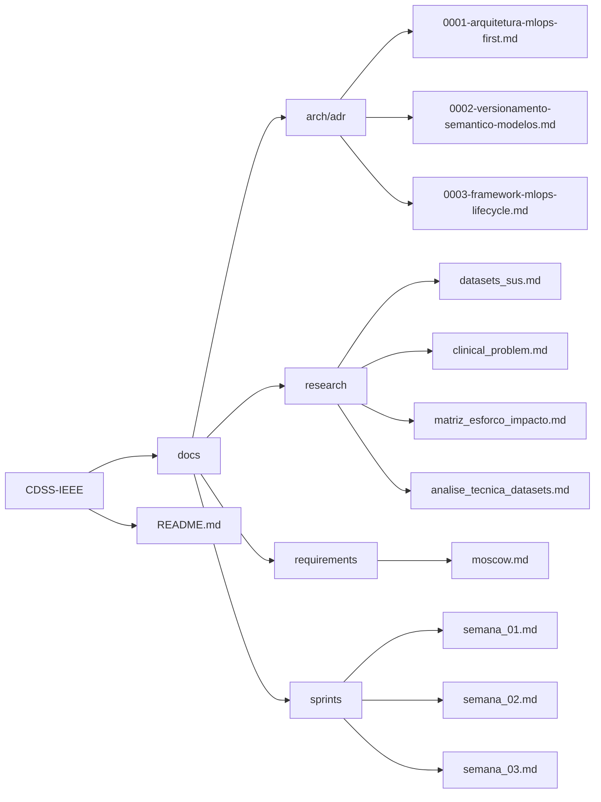

# CDSS-BR: Apoio à Decisão Clínica para o SUS

Este repositório concentra a documentação, propostas de investigação e especificações técnicas de um Sistema de Apoio à Decisão Clínica (CDSS) voltado à triagem e avaliação de risco em agravos de interesse à saúde pública brasileira, utilizando bases de dados secundárias do Sistema Único de Saúde (SUS).

## Objetivos da Investigação

O projeto visa pesquisar, modelar e validar metodologias analíticas capazes de identificar precocemente pacientes com risco atípico ou probabilidade de agravamento clínico em unidades de atendimento. A plataforma atua unicamente como suporte computacional probabilístico e explicável, preservando a autoridade médica e sem emissão de laudos diagnósticos autônomos.

## Estrutura do Repositório

## Diretrizes de Uso dos Dados

A investigação apoia-se exclusivamente em registros administrativos e epidemiológicos desidentificados disponibilizados pelo Ministério da Saúde, respeitando integralmente as normas de privacidade civil e ética em pesquisa médica.

| Versão | Descrição | Autor(es) | Data | Revisor(es) | Data de Revisão |
|---|---|---|---|---|---|
| 1.1 | Atualização da estrutura do repositório incluindo documentação de sprints e análises técnicas | [Artur Mendonça Arruda](https://github.com/ArtyMend07) | 2026-08-03 | [Artur Mendonça Arruda](https://github.com/ArtyMend07) | 2026-08-03 |
| 1.2 | Refatoração estrutural da apresentação visual (Mermaid.js) e adição de governança de ADRs MLOps | [Artur Mendonça Arruda](https://github.com/ArtyMend07) | 2026-08-18 | [Artur Mendonça Arruda](https://github.com/ArtyMend07) | 2026-08-18 |
